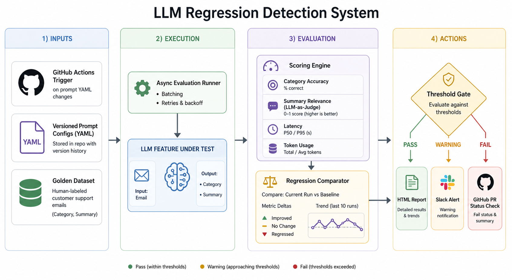

# LLM Regression Detection System

A regression testing system for LLM-powered features. The project evaluates a versioned LLM feature against a golden dataset, compares the results to a baseline, and supports report generation, alerting, and CI/CD gating for prompt and model changes [1][2].

## Problem

LLM applications change frequently. Prompt edits, model upgrades, and inference changes can alter behavior in ways that are difficult to detect without stable test data and repeatable evaluation workflows.

This project addresses that operational problem by treating model behavior as something that can be versioned, tested, compared, and gated before deployment rather than evaluated informally after release.

## Architecture




The system is organized into four layers:

- **Inputs**: GitHub Actions triggers, versioned YAML prompt configurations, and a human-labeled golden dataset.
- **Execution**: an evaluation runner invokes the LLM feature under test and captures structured outputs.
- **Evaluation**: a scoring engine measures category accuracy, summary quality, latency, and token usage, then compares the current run against a baseline.
- **Actions**: configurable thresholds determine whether the system produces an HTML report, sends a Slack alert, or blocks a pull request through CI status checks.

## Scope

The repository currently contains the feature under test and the core contracts required for later evaluation and CI/CD layers.

Included in this repository:

- Customer support email classifier that returns a category and one-sentence summary.
- Versioned prompt configuration stored in YAML.
- Typed request, response, and prompt schemas using Pydantic.
- OpenAI-backed inference wrapper.
- Smoke tests and unit tests for core contracts and prompt loading.

Planned system components:

- Golden dataset with human-labeled test cases.
- Batch evaluation runner with per-case metrics.
- Baseline comparison and regression detection.
- HTML diff reports.
- Slack alerts.
- GitHub Actions integration.
- SQLite-backed run history and drift tracking.

## Repository Structure

```text
phase-1/
├── app/
│   ├── llm/
│   │   ├── client.py
│   │   └── classifier.py
│   ├── models/
│   │   ├── contracts.py
│   │   └── prompt_config.py
│   ├── prompts/
│   │   └── loader.py
│   ├── exceptions.py
│   ├── logging_config.py
│   ├── main.py
│   ├── settings.py
│   └── smoke_test.py
├── prompts/
│   └── support_classifier_v1.yaml
├── tests/
├── pyproject.toml
└── README.md
```

## Setup

### Prerequisites

- Python 3.11+
- OpenAI API key
- Virtual environment recommended

### Installation

```bash
cd phase-1
python -m venv .venv
source .venv/bin/activate
pip install -e .[dev]
```

Create a `.env` file with the required settings:

```bash
OPENAI_API_KEY=your_key_here
OPENAI_MODEL=gpt-4o-mini
OPENAI_TIMEOUT_SECONDS=30
OPENAI_MAX_RETRIES=2
APP_ENV=development
LOG_LEVEL=INFO
```

## Usage

Run the classifier:

```bash
python -m app.main --email "I was charged twice for my subscription and need a refund."
```

Run the smoke test:

```bash
python -m app.smoke_test
```

Run the unit tests:

```bash
pytest
```

## Design Decisions

### Prompt versioning

Prompts are stored as YAML configuration files so prompt changes are reviewable, diffable, and easy to connect to CI triggers when files in the `prompts/` directory change.

### Typed interfaces

The classifier input, output, and prompt configuration are validated with Pydantic so downstream evaluation code can depend on stable schemas rather than parse free-form text.

### Local-first storage

The project favors portable components such as YAML, JSON, Python modules, and planned SQLite storage so the system remains easy to inspect, easy to run locally, and simple to evolve before introducing heavier infrastructure.

### Custom evaluation layer

DeepEval and RAGAS are useful for later metric expansion, but the initial design keeps evaluation logic explicit so scoring, diffing, and thresholding remain understandable and easy to extend.

## Tradeoffs

| Decision | Choice | Benefit | Tradeoff |
|---|---|---|---|
| Prompt storage | YAML | Readable and versionable | Requires schema discipline |
| Output validation | Pydantic | Stable structure for evaluation | Adds setup overhead |
| Evaluation | Custom first | Keeps scoring and diffing explicit | More implementation work |
| Run storage | Local files / SQLite | Portable and simple | Not multi-user by default |
| Reporting | HTML | Easy to attach to CI artifacts | Less interactive than a dashboard |
| Alerting | Slack webhooks | Realistic operational workflow | Limited compared with full incident tooling |

## Golden Dataset Strategy

The golden dataset is the core quality asset in the system. Evaluation quality depends on whether benchmark cases are realistic, stable, and correctly labeled [2][3].

Each test case is intended to include:

- Stable test ID.
- Input email text.
- Expected category.
- Reference summary.
- Difficulty label.
- Human notes explaining why the case exists.

The dataset is designed to begin with hand-labeled examples and expand over time with failure cases identified during evaluation. That keeps the benchmark tied to real system behavior rather than synthetic examples alone.

## Roadmap

### Phase 2
- Add 50–100 human-labeled support emails across billing, technical, account, and general categories.
- Include edge cases such as ambiguity, typos, short requests, sarcasm, and mixed-language inputs.

### Phase 3
- Run the classifier across the golden dataset with async batching.
- Capture category match, summary relevance, latency, and token usage.
- Compare each run to a baseline and identify regressions or improvements.

### Phase 4
- Generate HTML diff reports with run metadata and regressed cases.
- Send Slack alerts when configured thresholds are crossed.
- Track trends and slow drift across runs.

### Phase 5
- Trigger evaluations from GitHub Actions when prompt files change.
- Post pull request summaries and block merges on critical regressions.
- Containerize the system with Docker for reproducible execution.

## Tech Stack

| Component | Choice | Rationale |
|---|---|---|
| Language | Python 3.11+ | Standard ecosystem for ML and LLM tooling |
| LLM provider | OpenAI API | Widely used and easy to swap later |
| Schema validation | Pydantic | Stable interfaces for configs and outputs |
| Prompt versioning | YAML | Human-readable and diff-friendly |
| Testing | Pytest | Simple and CI-friendly |
| Logging | Structured Python logging | Better observability during development |
| Evaluation support | DeepEval and/or RAGAS | Useful for advanced LLM evaluation metrics|
